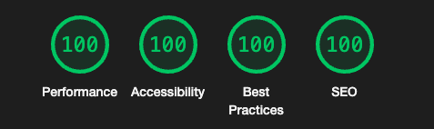

# Equalizer Landing Page

## 🚀 Features

- Optimal layout depending on their device's screen size.
- See hover states for interactive elements.

## 🛠️ Technologies Used

- **Next.js**: React framework for building modern web applications.
- **TypeScript**: For type-safe development.
- **Tailwind**: Utility first CSS framework.
- **ShadCN**: Component library for React.

## 🌐 Live Demo

- <a href="https://fylo-landing-page-with-dark-theme-five.vercel.app" target="_blank">Live Demo</a>

## 🌟 Lighthouse Score

  

## 🌄 Preview

  

## Author

- LinkedIn - [Gümrah Sindar](https://www.linkedin.com/in/gumrahsindar/)
